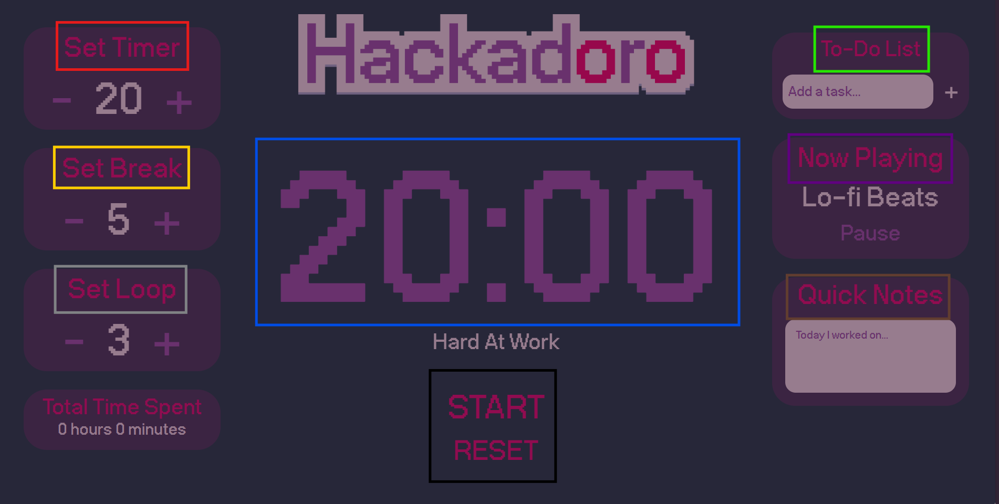

# Hackadoro

### What Is Hackadoro?

- A pomodoro timer with extra features.

### How does it work?

1. Set the time you wanna work for (blue)
2. Set how long you want your breaks to be (yellow)
3. Set how many times you want it to repeat for (grey)
4. Press the reset button (bottom black)
5. Press the start button (top black)

- You can set music to one of 3 options (purple)
- You can add to do notes that will save even when you reload the page or when you close and reopen the tab (just dont clear cookies/cache)(green)
- You can take quick notes, but these will disappear if you reload the screen (brown)

### If You Notice Any Bugs...

- Lmk!! You can do that by DMing me on slack @louisa or discord @v1peridae.
